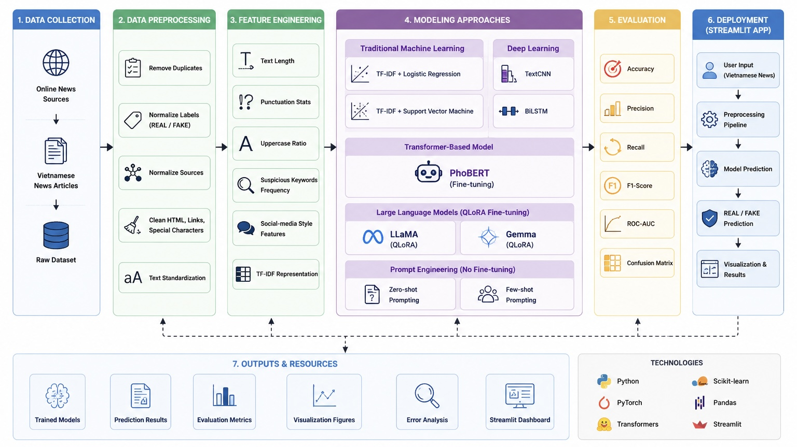

# PHÁT HIỆN NỘI DUNG BÁO CHÍ ĐÁNG TIN CẬY VÀ KHÔNG ĐÁNG TIN CẬY TRÊN DỮ LIỆU TIẾNG VIỆT


<div align="center">

### IE403 – Khai Thác Dữ Liệu Truyền Thông Xã Hội

**Trường Đại học Công nghệ Thông tin (UIT) – ĐHQG TP. Hồ Chí Minh**

---

Đồ án nghiên cứu và xây dựng hệ thống phát hiện nội dung báo chí tiếng Việt đáng tin cậy / không đáng tin cậy bằng các phương pháp Machine Learning, Deep Learning, Transformer và Large Language Models.

</div>

---

# Giới Thiệu

Sự phát triển mạnh mẽ của Internet và các nền tảng truyền thông số đã làm gia tăng đáng kể tốc độ lan truyền thông tin. Bên cạnh những lợi ích tích cực, các nội dung sai lệch, thiếu kiểm chứng hoặc mang tính chất tin giả ngày càng xuất hiện phổ biến và ảnh hưởng trực tiếp đến nhận thức của cộng đồng.

Đề tài tập trung xây dựng hệ thống tự động phân loại nội dung báo chí tiếng Việt thành hai nhóm:

* Đáng tin cậy (REAL)
* Không đáng tin cậy (FAKE)

thông qua việc nghiên cứu, triển khai và so sánh nhiều hướng tiếp cận khác nhau, từ các mô hình Machine Learning truyền thống đến Transformer và Large Language Models (LLMs).

---

# Mục Tiêu Đề Tài

* Xây dựng bộ dữ liệu phục vụ bài toán phát hiện nội dung báo chí đáng tin cậy / không đáng tin cậy.
* Thiết kế pipeline NLP hoàn chỉnh cho dữ liệu tiếng Việt.
* So sánh hiệu quả của nhiều nhóm mô hình AI khác nhau.
* Đánh giá khả năng ứng dụng của Transformer và LLM trong bài toán phân loại văn bản.
* Xây dựng website kiểm chứng tin tức bằng Streamlit.

---

# Bộ Dữ Liệu

## Nguồn dữ liệu đáng tin cậy (REAL)

* VnExpress
* Tuổi Trẻ
* Thanh Niên
* Dân Trí
* Vietnamnet
* Sức Khỏe & Đời Sống

## Nguồn dữ liệu không đáng tin cậy (FAKE)

* Các bài viết đã được fact-check
* Nội dung sai lệch trên mạng xã hội
* Tin tức lừa đảo
* Thông tin sức khỏe thiếu kiểm chứng
* Các trường hợp misinformation và disinformation

## Thống kê dữ liệu

| Loại dữ liệu | Số lượng |
| ------------ | -------- |
| REAL         | 9,639    |
| FAKE         | 5,243    |
| Tổng cộng    | 14,882   |

---

---

# Demo

## Website Demo

https://ie403-vietnamese-fake-news-detection-cilvirgvmfnq3nxifyj886.streamlit.app

## PhoBERT Model

https://huggingface.co/nghuxung/phobert-fake-news

---

# Kiến Trúc Hệ Thống

<p align="center">
  
</p>

Hệ thống được xây dựng theo quy trình khép kín từ thu thập dữ liệu, tiền xử lý, trích xuất đặc trưng, huấn luyện mô hình, đánh giá hiệu năng và triển khai thành ứng dụng web.

---

# Quy Trình Thực Hiện

## Giai đoạn 1 – Thu thập và xử lý dữ liệu

* Thu thập dữ liệu từ nhiều nguồn báo chí tiếng Việt.
* Loại bỏ dữ liệu trùng lặp.
* Chuẩn hóa nhãn REAL / FAKE.
* Làm sạch HTML và ký tự nhiễu.
* Chuẩn hóa Unicode và định dạng văn bản.

## Giai đoạn 2 – Feature Engineering

Xây dựng các đặc trưng hỗ trợ phân loại:

* Độ dài tiêu đề
* Độ dài nội dung
* Tỷ lệ chữ in hoa
* Số lượng dấu chấm than
* Số lượng dấu hỏi
* Clickbait indicators
* Thống kê từ khóa đáng ngờ

## Giai đoạn 3 – Khám phá dữ liệu (EDA)

* Phân tích phân bố nhãn.
* Phân tích nguồn dữ liệu.
* Word Frequency Analysis.
* Visualization và thống kê mô tả.

## Giai đoạn 4 – Huấn luyện mô hình

* Machine Learning
* Deep Learning
* Transformer
* Large Language Models
* Prompt Engineering

## Giai đoạn 5 – Đánh giá và triển khai

* So sánh mô hình.
* Phân tích lỗi.
* Xây dựng Streamlit Dashboard.

---

# Các Mô Hình Được Triển Khai

## Machine Learning

### TF-IDF + Logistic Regression

Mô hình baseline sử dụng biểu diễn TF-IDF kết hợp Logistic Regression.

### TF-IDF + SVM

Mô hình truyền thống mạnh trên dữ liệu văn bản có số chiều lớn.

---

## Deep Learning

### TextCNN

Khai thác các đặc trưng cục bộ trong văn bản bằng Convolutional Neural Networks.

### BiLSTM

Học ngữ cảnh theo hai chiều và nắm bắt quan hệ phụ thuộc dài hạn trong câu.

---

## Transformer

### PhoBERT Fine-Tuning

PhoBERT là mô hình Transformer được huấn luyện chuyên biệt cho tiếng Việt bởi VinAI Research.

---

## Large Language Models

### LLaMA QLoRA

Fine-tuning mô hình LLaMA bằng kỹ thuật QLoRA giúp giảm đáng kể chi phí tính toán.

### Gemma QLoRA

Fine-tuning mô hình Gemma của Google cho bài toán phát hiện tin giả tiếng Việt.

---

## Prompt Engineering

### Zero-shot Prompting

Không huấn luyện mô hình, chỉ sử dụng Prompt để suy luận.

### Few-shot Prompting

Cung cấp một số ví dụ trong Prompt để hỗ trợ mô hình dự đoán.

---

# Kết Quả Thực Nghiệm

| Mô hình             | Accuracy   | Precision  | Recall     | F1-score   | ROC-AUC    |
| ------------------- | ---------- | ---------- | ---------- | ---------- | ---------- |
| TF-IDF + LR         | 0.9342     | 0.9250     | 0.9327     | 0.9286     | 0.9771     |
| TF-IDF + SVM        | 0.9498     | 0.9400     | 0.9500     | 0.9500     | 0.9875     |
| TextCNN             | 0.9458     | 0.9457     | 0.9458     | 0.9457     | 0.9855     |
| BiLSTM              | 0.9315     | 0.9227     | 0.8793     | 0.9005     | 0.9767     |
| PhoBERT             | 0.9749     | 0.9706     | 0.9748     | 0.9727     | 0.9963     |
| **LLaMA QLoRA**     | **0.9758** | **0.9700** | **0.9700** | **0.9735** | **0.9965** |
| Gemma QLoRA         | 0.9557     | 0.9511     | 0.9519     | 0.9557     | 0.9875     |
| Zero-shot Prompting | 0.6480     | 0.6480     | 1.0000     | 0.7864     | 0.5000     |
| Few-shot Prompting  | 0.6480     | 0.6480     | 1.0000     | 0.7864     | 0.5000     |

## Nhận xét

* LLaMA QLoRA đạt kết quả tốt nhất trên tập kiểm thử.
* PhoBERT cho hiệu năng rất cạnh tranh và phù hợp với tiếng Việt.
* Deep Learning truyền thống vẫn đạt hiệu quả tốt.
* Prompt Engineering không cần huấn luyện nhưng hiệu năng thấp hơn đáng kể so với các mô hình fine-tuning.

---

# Ứng Dụng Streamlit

Hệ thống được triển khai dưới dạng website hỗ trợ:

### Trang Chủ

Giới thiệu đề tài và quy trình nghiên cứu.

### Dự Đoán Tin Tức

Người dùng nhập tiêu đề và nội dung bài viết để nhận kết quả:

* REAL
* FAKE

cùng xác suất dự đoán.

### So Sánh Mô Hình

Hiển thị kết quả đánh giá của tất cả mô hình.

### Khám Phá Dữ Liệu

Trực quan hóa dữ liệu và các thống kê mô tả.

# Triển Khai Hệ Thống

Hệ thống được triển khai hoàn chỉnh trên nền tảng Streamlit Cloud.

Để giảm kích thước repository và thuận tiện cho việc triển khai, mô hình PhoBERT sau khi fine-tune được lưu trữ trên Hugging Face Hub.

Kiến trúc triển khai:

Người dùng
↓
Streamlit Cloud
↓
PhoBERT trên Hugging Face Hub

Website sẽ tự động tải mô hình từ Hugging Face khi khởi động.

---

# Cấu Trúc Dự Án

```text
IE403-Vietnamese-Fake-News-Detection
│
├── assets/
│
├── data/
│
├── models/
│
├── notebooks/
│
├── outputs/
│
├── report/
│
├── streamlit_app/
│   ├── app.py
│   ├── utils/
│   ├── assets/
│   └── data/
│
├── README.md
├── requirements.txt
└── .gitignore
```

---

# Hướng Dẫn Cài Đặt

## 1. Clone Repository

```bash
git clone https://github.com/nghuxung/IE403-Vietnamese-Fake-News-Detection.git

cd IE403-Vietnamese-Fake-News-Detection
```

---

## 2. Tạo Môi Trường Ảo (Khuyến nghị)

### Windows

```bash
python -m venv .venv

.venv\Scripts\activate
```

### macOS / Linux

```bash
python3 -m venv .venv

source .venv/bin/activate
```

Sau khi kích hoạt thành công, terminal sẽ hiển thị:

```bash
(.venv)
```

---

## 3. Cài Đặt Thư Viện

Nâng cấp pip:

```bash
pip install --upgrade pip
```

Cài đặt toàn bộ thư viện cần thiết:

```bash
pip install -r requirements.txt
```

Kiểm tra Streamlit:

```bash
streamlit --version
```

---

## 4. Chuẩn Bị Mô Hình

Do kích thước của các mô hình sau khi fine-tune khá lớn nên repository GitHub không lưu trực tiếp trọng số mô hình.

PhoBERT được lưu trữ trên Hugging Face Hub:

https://huggingface.co/nghuxung/phobert-fake-news

Ứng dụng Streamlit sẽ tự động tải mô hình từ Hugging Face khi khởi động.

Người dùng không cần tải thủ công thư mục models.

---

# Công Nghệ Sử Dụng

* Python
* PyTorch
* Transformers
* PhoBERT
* LLaMA
* Gemma
* Scikit-Learn
* Streamlit
* Pandas
* NumPy
* Matplotlib
* Plotly

---

# Thành Viên Nhóm

| Họ và tên              | MSSV     |
| ---------------------- | -------- |
| Nguyễn Huỳnh Xuân Nghi | 23521004 |
| Đinh Nguyễn Anh Thư    | 23521534 |
| Tou Prong Ma Tiêm      | 23521566 |
| Nguyễn Thị Huệ Trinh   | 23521662 |
| Nguyễn Trần Phương Vy  | 23521835 |

---

# Lời Cảm Ơn

Nhóm xin chân thành cảm ơn giảng viên hướng dẫn cùng Trường Đại học Công nghệ Thông tin – ĐHQG TP.HCM đã tạo điều kiện và hỗ trợ nhóm trong quá trình thực hiện đồ án.

---
